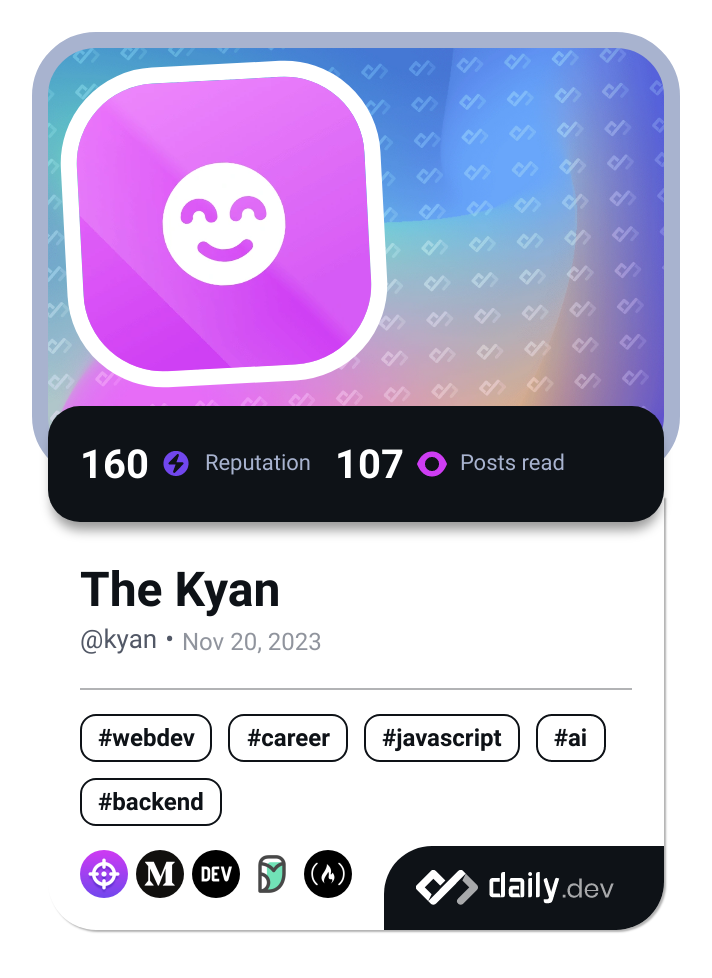

- 👋 Hi, I’m @Ken-Andre or Kenmogne Andre
- 👀 I’m interested in e-gaming,music,discovering and programming...
- 🌱 I’m currently learning electronic,C++, React and...
- 💞️ I’m looking to collaborate on fun projects open source.
- 📫 How to reach me thekyan@hi2.in :)

<!---
Ken-Andre/Ken-Andre is a ✨ special ✨ repository because its `README.md` (this file) appears on your GitHub profile.
You can click the Preview link to take a look at your changes.
--->
